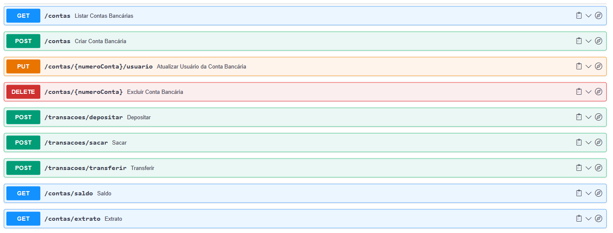

# API de Banco Digital - Desafio Módulo 2 - Back-end Cubos Academy

Bem-vindo à API de Banco Digital! Esta é uma aplicação piloto de um banco digital que oferece uma série de funcionalidades para contas bancárias. Esta API permite criar contas, realizar transações, consultar saldos e extratos, entre outras funcionalidades.

## Documentação da API - Swagger

A documentação da API está disponível [aqui](https://app.swaggerhub.com/apis-docs/maxsonferovante/api_banco_digital/1.0.0#/).

## Como Usar

1. Faça o fork deste repositório para o seu próprio GitHub.
2. Clone o seu repositório em sua máquina local.
3. Instale as dependências com `npm install`.
4. Inicie o servidor local com `npm run dev`.
5. Acesse os endpoints da API usando ferramentas como Postman ou curl. Indico o Insominia, uma vez que disponibilizo um arquivo com os endpoints para exportação e testes.

**Arquivo para exportação - Insominia**
[Insomnia.json](Insomnia_2023-09-01.json)

Lembre-se de substituir os valores entre chaves (`{}`) pelos valores reais ao fazer as requisições.

---